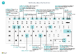

# Riferimento rapido per tasti di scelta rapida - Solo PCKeyboard Quick Reference - PC Only

#### GeneraleGeneral

|Premere questi tastiPress these keys|Operazione da eseguireTo do this|  
|-|-|
|Alt+F2Alt+F2 ALT+NAlt+N ALT+MAIUSC+NAlt+Shift+N ALT+OAlt+O ALT+QAlt+Q ALT+SUAlt+Up ALT + freccia GIÙAlt+Down Arrow ALT+TAlt+T ALT+MAIUSC+WAlt+Shift+W CTRL+INSCtrl+Insert CTRL-CANCCtrl-Delete Ctrl+Shift+F12Ctrl+Shift+F12 Ctrl+F1Ctrl+F1 CTRL+clicCtrl+Click Shift+F12Shift+F12 F5/CTRL+F5F5/Ctrl+F5 TAB/MAIUSC + TABTab/Shift+Tab F6/MAIUSC+F6F6/Shift+F6 |Visualizzare e nascondere il riquadro Dettaglio informazioniShow and hide the FactBox pane Creare un nuovo recordCreate a new record Chiudere un record appena creato e creane uno nuovoClose a newly created record and create a new one Aggiungere una nuova nota per il record selezionatoAdd a new note for the selected record Aprire la funzionalità delle **informazioni**Open **Tell me** Aprire la descrizione comando o l'errore di convalidaOpen tooltip or validation error Aprire un menu a discesa o lookupOpen a drop-down or look up Aprire la pagina **Impostazioni personali**Open the **My Settings** page Aprire la scheda o il documento corrente in una nuova finestraOpen the current card or document in a new window Inserire una nuova riga in un documentoInsert a new line on a document Eliminare la riga in un documento, giornale o foglio di lavoroDelete the line on a document, journal, or worksheet Ingrandire la parte Voci in una pagina del documentoMaximize the line items part on a document page Aprire la Guida per la paginaOpen help for the page Spostarsi durante la personalizzazioneNavigate when personalizing and customizing Aprire Esplora ruoli, una panoramica delle funzionalitàOpen the role explorer, a feature overview Aggiornare/ricaricare la paginaRefresh/reload page Spostare lo stato attivo sull'elemento successivo/precedenteMove focus to the next/previous element Spostare il cursore alla Scheda dettaglio/parte successiva.Move to next FastTab/part|

#### Spostarsi e selezionare righeNavigate & Select Rows

|Premere questi tastiPress these keys|Operazione da eseguireTo do this|
|-|-|
|Home/FineHome/End CTRL+HOME/FINECtrl+Home/End  CTRL+MAIUSC+FRECCIA SU/GIÙCtrl+Up/Down CTRL+ACtrl+A  CTRL+SPAZIOCtrl+Space Ctrl/Maiusc+ClicCtrl/Shift+Click MAIUSC+FRECCIA SU/GIÙShift+Up/Down MAIUSC+PGGIÙ/SUShift+Page Up/Down Ctrl+EnterCtrl+Enter|Passare al primo/ultimo campoGo to first/last field Passare alla prima/ultima rigaGo to first/last row Spostarsi senza perdere la selezioneNavigate without losing selection Selezionare tuttoSelect all Attivare/disattivare la selezione delle righeToggle row selection  Aggiungere le righe alla selezioneAdd the row/rows to the selection Aggiungere la riga precedente/successiva alla selezioneAdd row above/below to selection Selezionare righe visibili sopra/sottoSelect visible rows above/below  Spostare lo stato attivo fuori dall'elencoFocus out of the list|

#### Copiare e incollareCopy & Paste

|Premere questi tastiPress these keys|Operazione da eseguireTo do this|
|-|-|
|CTRL+C/VCtrl+C/V F8F8|Copiare/incollare righeCopy/paste rows Copiare il campo soprastante nella riga correnteCopy field above into current row|

#### Cercare, filtrare e ordinareSearch, Filter, & Sort

|Premere questi tastiPress these keys|Operazione da eseguireTo do this|
|-|-|
|Alt+F7Alt+F7 F3F3 Shift+F3Shift+F3 Ctrl+Shift+F3Ctrl+Shift+F3 Alt+F3Alt+F3 MAIUSC+ALT+F3Shift+Alt+F3 Ctrl+Alt+Maiusc+F3Ctrl+Alt+Shift+F3|Ordinare la colonna in ordine crescente/decrescenteSort column in ascending/descending order Attivare/disattivare la ricercaToggle search Attivare/disattivare il riquadro Filtro	; spostare lo stato attivo sui filtri del campoToggle filter pane; focus on field filters Attivare/disattivare il riquadro Filtro; spostare lo stato attivo sui filtri dei totaliToggle filter pane; focus on totals filters Filtrare il valore della cella selezionataFilter on selected cell value Aggiungere un filtro sul campo selezionatoAdd filter on selected field Reimposta filtriReset filters|

#### Accesso rapidoQuick Entry

|Premere questi tastiPress these keys|Operazione da eseguireTo do this|
|-|-|
|CTRL+MAIUSC+INVIOCtrl+Shift+Enter INVIO/MAIUSC+INVIOEnter/Shift+Enter|Passare al campo Accesso rapido seguente al di fuori di un elencoGo to next Quick Entry field outside a list Passare al campo Accesso rapido successivo/precedenteGo to next/previous Quick Entry field|

##### Visualizzare in anteprima un reportReport Preview

|Premere questi tastiPress these keys|Operazione da eseguireTo do this|
|-|-|
|CTRL+HOME/FINECtrl+Home/End|Passare alla prima/ultima paginaGo to the first/last page|

> [!TIP]
> Per una versione grafica facile da stampare, scegliere l'immagine seguente e scaricare il file PDF.For a graphical, print-friendly version, choose the following image and download the PDF file.
>
> 
